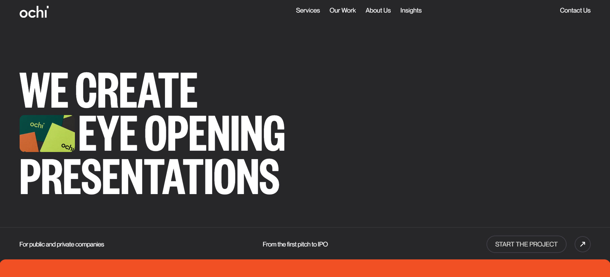
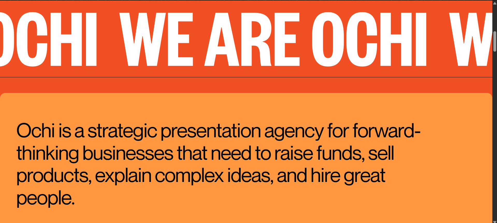
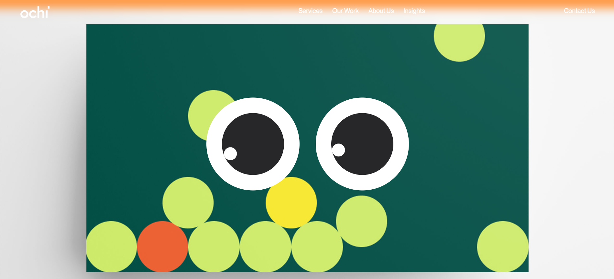
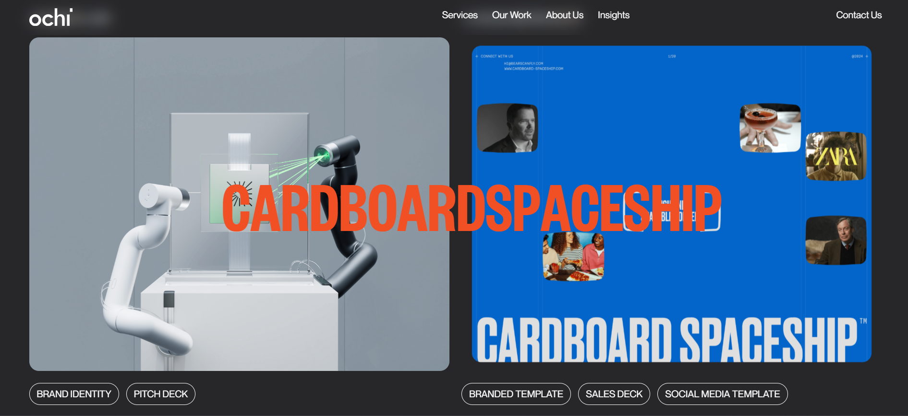
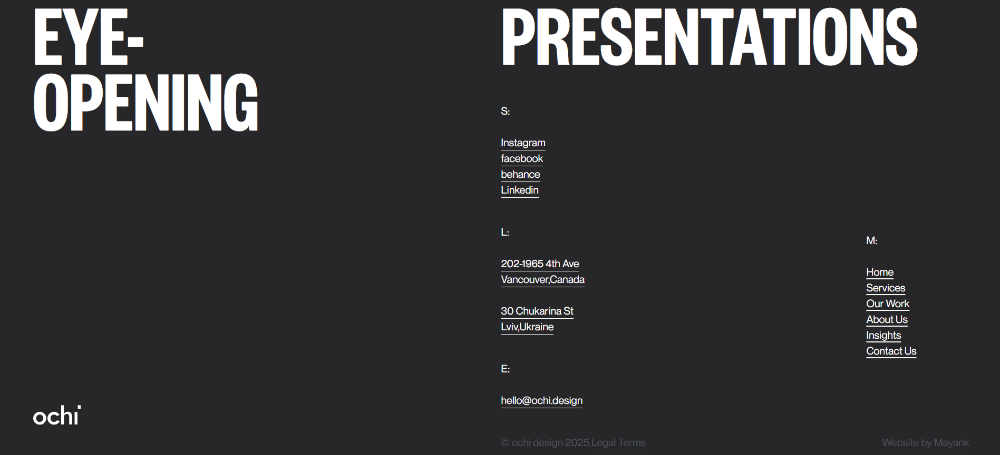

# 🧠 Ochi.Design Clone

A visual clone of [ochi.design](https://ochi.design) created using **React**, **Tailwind CSS**, **GSAP**, **Framer Motion**, and **Locomotive Scroll**. This project replicates the core layout, animations, and user experience of the original site as a learning and portfolio project.

> ❗ **Note:** This project is currently **not responsive** and is best viewed on desktop screens. Mobile responsiveness will be added in future updates.

---

## ✨ Features

- 🎨 Pixel-perfect layout inspired by the original Ochi.design
- 🎥 GSAP-powered timeline and scroll animations
- 🌀 Smooth parallax scrolling with Locomotive Scroll
- 💫 Interactive UI using Framer Motion
- ⚛️ React component-based architecture
- 💨 Tailwind CSS for utility-first styling

---

## 🧰 Tech Stack

| Technology           | Role                                  |
|----------------------|----------------------------------------|
| **React**            | Core frontend library                  |
| **Tailwind CSS**     | CSS framework for styling              |
| **GSAP**             | High-performance animations            |
| **Framer Motion**    | Motion components & transitions        |
| **Locomotive Scroll**| Smooth scrolling and parallax effects |

---

## 📸 Screenshots

### 🖼️ Hero Section


### 🖼️ Marquee Section


### 🖼️ Eyes Section


### 🖼️ Projects Section


### 🖼️ Footer Section



---

## 📜 Credits

- Original Website: [ochi.design](https://ochi.design)
- This project is a **personal clone** made for **educational and portfolio purposes only**.
- All design rights, text, and assets belong to the creators of the original site.

---

## 🚀 Getting Started

To run this project locally:

```sh
# Clone the repository
git clone https://github.com/your-username/ochi-clone.git

# Navigate into the project folder
cd ochi-clone

# Install dependencies
npm install

# Start the development server
npm run dev
```

Then, open your browser and go to `http://localhost:5173` (or the port shown in your terminal).

---

## ⚠️ Known Limitations

- ❌ Currently not responsive
- 📱 Mobile scroll behavior not optimized
- 🚧 Still improving UI consistency on smaller screens

---

## 🛠️ To-Do

- [ ] Make the layout fully responsive
- [ ] Optimize for mobile performance
- [ ] Add a light/dark theme toggle

---

## 📄 License

This repository is licensed for **personal learning and non-commercial portfolio use only**.
